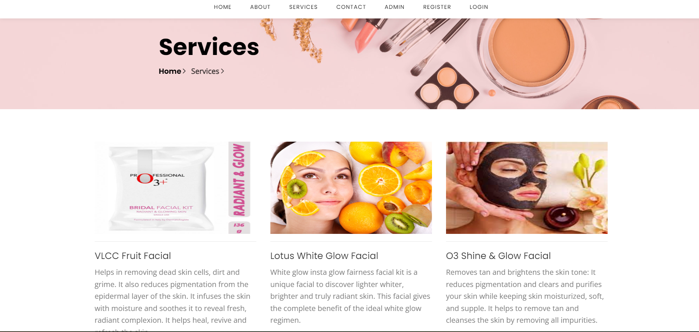

<<<<<<< HEAD
# Beauty Service Application

This project is a comprehensive web application designed to enhance the user experience for salon customers and streamline the management processes for salon administrators. The application addresses several common challenges faced by both customers and salon management by providing efficient solutions.

## Features

- **Customer Interface:**
  - View available salon services
  - Schedule and manage appointments
  - Access service provider details
  - Contact service providers directly through the platform

- **Admin Panel:**
  - Secure login and registration for salon management
  - Manage appointments and schedules
  - Provide and update service offerings
  - Generate and manage customer bills

## Technologies Used

- **Frontend:** HTML, CSS, JavaScript
- **Backend:** PHP
- **Database:** MySQL

## Screenshots 

- **HomePage:** 

- **ServicePage:** 

- **Register Page:** 

- **Login Page:** 

- **Book Appointment:** 

- **Book History:** 

- **Bill History:**

- **Admin Login:**

- **Admin Dashboard:**

=======
# BeautyServiceApp
>>>>>>> 5bc9eeaf7de6ae201e421560136f2b1baaade160
